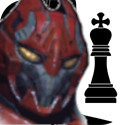

# Chazzbot
Chess AI, using a feed-forward neural network as a value function and some simple tree search. Build with Keras and Tensorflow trained on Grandmaster championship games fetched from [https://www.pgnmentor.com/files.html.](https://www.pgnmentor.com/files.html) 

The project uses a flask server as an interface.

## Manual
- `python3 data_extractor.py`, on run converts all `.pgn` data contained in the folder `data` to the model's internal format. Stores the converted data in the folder `ext` as json.
- `python3 move_predictor.py -t <name>`, trains a new model with the data in `ext` and stores the model in `model` under the given model name
- `python3 move_predictor.py -pg <name>`, initiates a game for the AI to play against itself. Uses the model with the name given as argument.
- `python3 move_predictor.py -s <name>`, launches as simple rest api for clients to request predictions. Uses the model with the name given as argument.

The provided model with the name of "oo.h5" can be used to perform good estimation. The uploaded setup searches only two moves forwards by default, though this can be changed.

## Potential improvements

- Apply some search algorithm to find the best move quicker.
- Add some alpha-beta pruning.
- Add support for casteling and so on for the backend.
